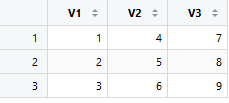
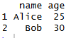

R is designed for **data analysis, statistics, and visualization**. It
emphasizes working with data structures like vectors, data frames, and
lists, and provides powerful tools for analysis and reporting.

This guide introduces the fundamental syntax used in R programs.

------------------------------------------------------------------------

## Running R

You can run R in several ways, with the simplest being via the command
line or the interactive R console.

### Interactive R Console

#### Windows

Open the Command Prompt and type:

``` bash
R
```

#### macOS

Open the Terminal and type:

``` bash
R
```

You can also use **RStudio**, a popular integrated development
environment (IDE) for working with R. We will talk more about this later. 

------------------------------------------------------------------------

## R Syntax

Practice writing and executing the following using the R console.\
To execute a line of code, press the *Enter* key. 

Note: to exit the R console write and execute ```quit()```

------------------------------------------------------------------------

## Comments

Comments are ignored by R and help explain your code.

### Single Line Comment

Starts with `#`

``` r
# This is a comment

print("This code will execute!")
```

### Variables 
Variables store value and are assigned using <- (recommended) or =. 

``` r
name <- "Alice"
age <- 30
height <- 5.6
```
### Variable Naming Rules 

Don't include special characters in your variable assignments 
 
``` r
don't_do_this! <- "please"
```

Don't start variable assignments with numbers.  
 

``` r
3_favorite_things <- ('movies, candy, family')

```

We want our variable names to start with characters. 

```r

three_favorite_things <- ('movies, candy, family')

```r

------------------------------------------------------------------------

## Basic Data Types

### Character (Strings)

``` r
message <- "Hello"
```

### Numeric

``` r
count <- 10

temperature <- 98.6

```

### Logical (Boolean)

``` r
is_active <- TRUE
```

------------------------------------------------------------------------

## Printing Output

Use `print()` or simply type the variable name.

``` r
print("Hello World")

name <- "Alice"
print(paste("Hello", name))

#This will return: Hello, Alice

number <- 22
print(number)

#This will return: 22

test <- TRUE
print(test == TRUE)

#This will return: TRUE
```

------------------------------------------------------------------------

## User Input

R can accept user input using `readline()`.

``` r
name <- readline(prompt = "Enter your name: ")
print(paste("Hello", name))
```

------------------------------------------------------------------------

## Type Conversion

Convert between data types using built-in functions.

  |Function          | Purpose|
  |------------------|---------|
  |`as.integer()`|convert to integer|
  |`as.numeric()`|convert to numeric|
  |`as.character()`|convert to string|


``` r
age <- as.integer("30")
temperature <- as.numeric("98.6")
number <- as.character(42)
```

------------------------------------------------------------------------

## Arithmetic Operators

R supports standard mathematical operations.

``` r
a <- 10
b <- 3

a + b
a - b
a * b
a / b
a^b
a %% b
```

------------------------------------------------------------------------

## Comparison Operators

These are used to **Compare** Values and Variable

``` r
x <- 10
y <- 5

x > y
x < y
x == y
x != y
```

------------------------------------------------------------------------

## Conditional Statements

Conditional statements control program flow.

### if statements

If statements evaluate a condition and provide an appropriate output based on
if that condition is **true** or **false** 

``` r
age <- 18
if (age >= 18) {
  print("You are an adult")
}

```
### if else statements

These statements will evaluate if a conditoin is **true** or **false** and will 
provide statement for both options. 

```r
age <- 18
 if (age >= 18) {
   print("You are an adult")
} else {
   print("you are not an adult")
 }
```
### else if statments 

These statements will allow for **multiple different** conditional statements to be 
evaluated. 

```r
age <- 18
 if (age >= 18) {
   print("You are an adult")
} else if (13 < age < 18) {
print("You are a teenager")
}
else {
   print("you are a child")
 }
```
------------------------------------------------------------------------

## Loops

Loops will cycle through a set range of values and run a program for every
iteration

### For Loop


``` r
for (i in 1:5) {
  print(i)
}

# This loop will print the numbers 1-5. 
```

### While Loop

``` r
count <- 0
while (count < 5) {
  print(count)
  count <- count + 1
}
```

------------------------------------------------------------------------

## Vectors

Vectors are series of data such as **numbers**,**strings**, and characters 
``` r
numbers <- c(1, 2, 3, 4, 5)

# We can call the number 1 with this command 

print(numbers[1])


```


-------------------------------------------------------------------------------


## Matrices

Matrices can be thought of as a two dimensional vector. 

```

# to make a matrix, we can assign our numbers of rows and columns to set our 
dimensions 

numbers <- matrix (c(1,2,3,4,5,6,7,8,9), nrow = 3, ncol = 3)

```

Using this command will give us a matrix that looks like this. 


-------------------------------------------------------------------------------



-------------------------------------------------------------------------------


## Lists


``` r
my_list <- list(name = "Alice", age = 30, active = TRUE)
```

------------------------------------------------------------------------

## Data Frames

Data Frames allow us to make a set of data similar to a matrix.


``` r
df <- data.frame(
  name = c("Alice", "Bob"),
  age = c(25, 30)
)

print(df)
```

------------------------------------------------------------------------------



------------------------------------------------------------------------

## Functions

Functions allow us to take in **user input** and provide an outcome based on that 
input. These are largely applicable among all coding languages and are benfical 
to familiarize yourself with 


``` r
greet <- function(name) {
  print(paste("Hello", name))
}

greet("Alice")
```

------------------------------------------------------------------------

## Installing and Loading Packages

Packages are a series of commands and programs that are made outside of basic R,
commonly by developers and others. They allow us to perform functions beyond
the capabilities of basic r as well as simplifying actions hat would otherwise
be complex in r.

ggplot2 is one library that is important for creating data visualizations in r 
that would otherwise take a much longer time and require an extensive amount of 
code in base r. 


``` r
install.packages("ggplot2")
library(ggplot2)

```
### Package and Function Information

The help command is one of the most powerful tools in R. Running this command 
will allow you to view all information about base R commands as well as commands
that are stored within libraries

```r
help(print)

#This command will return a full resource page of how to use the print command as well as examples

```

------------------------------------------------------------------------

## Writing Your First Script

Lets look at an example of creating a script that returns someones name. Try
it out on your r console!

if we have a file named hello.R, we can make the following script in it. 

``` r
greetings <- function(name) {

if (nchar(name) > 0) {
  print(paste("Hello", name))
} else {
  print("Hello stranger")
}
}
```

Run from command line, or press CTRL + Enter to run your script:

``` bash
Rscript hello.R
```
