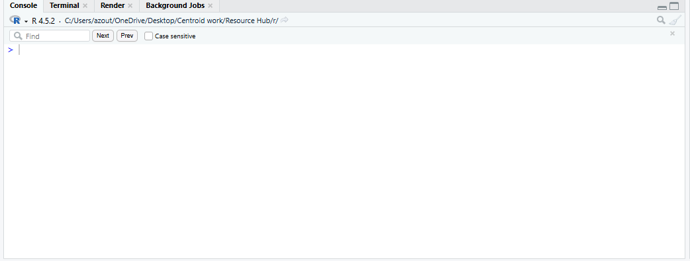
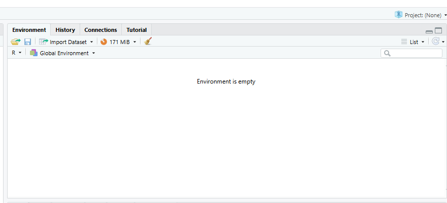
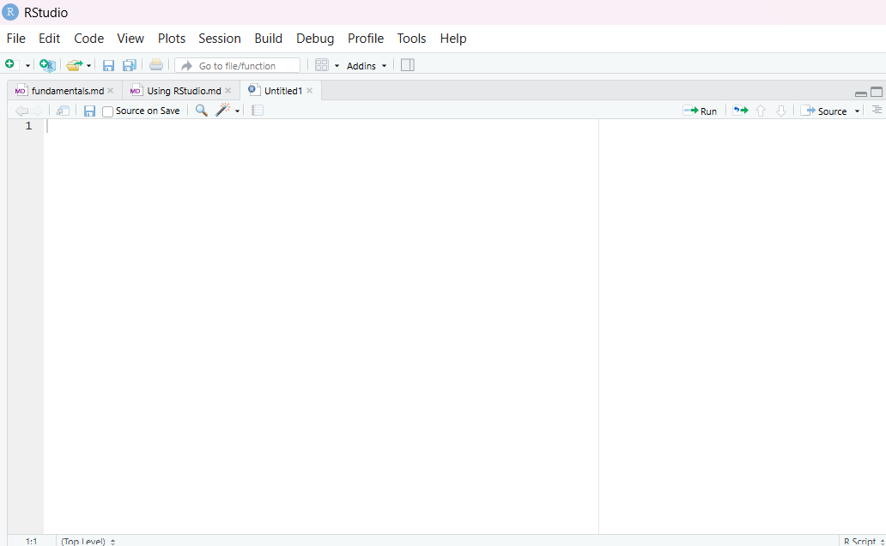
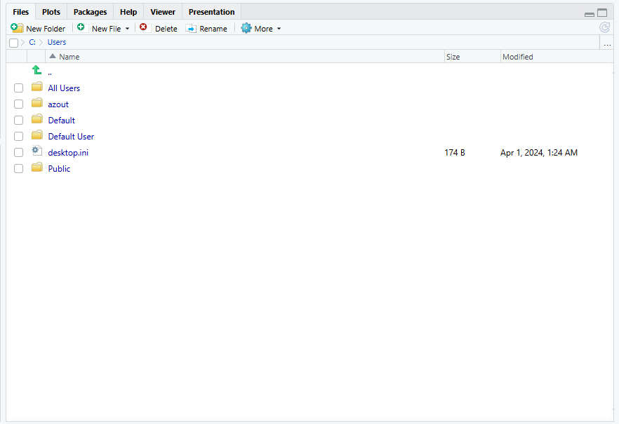

While base r provides the tools necessary to analyze complex datasets and perform
most necessary functions. Utiliizing R can be far easier through the use of RStudio.

This guide goes through the basics of the RStudio software. 

--------------------------------------------------------------------------------

## What is RStudio? 

RStudio is an Integrated Development Environment (IDE). It allows for individuals 
to run various coding languages; predominantly R, as well as providing more 
Resources then base R.

RStudio provides a coding environment,global environment, console, and file 
storage location, which all allow you to easily access various different datasets,
and projects. 

RSTudio also provides syntax highlighting and debugging assistance while writing code,
making it especialy suitable for beginner and intermediate coders.

--------------------------------------------------------------------------------

## Downloading RStudio

You can Download RStudio for Windows,MacOS, and other soft wares using the installer

[Visit The Downloading Site](https://docs.posit.co/ide/user/#rstudio-ide-oss-downloads)

---

## Navigating the RStudio Environment 

There are 4 sections of the environment that we will cover in this guide 
1. Console
2. Source 
3. Environment 
4. Output

### The Console 



-------------------------------------------------------------------------------


The console is where 1 line code is written to run single commands

The > arrow signifies the line that you will write code on 
```r
> #This is where you will write your commands
```

The + symbol tells you your command is incomplete 

```r
> print 
+ ("This is where you will need to finish your command")
```

The up arrow and down arrow will allow you to move through previously ran commands 


The console is especially useful when executing commands to make new folders, change working directories and 
connecting with github services. 

```r
mkdir ("New_Folder")

cd ("path/to/your/desired/folder.rmd")
```

### The Environment 


-------------------------------------------------------------------------------


The Environment column located at the top right is where all of our objects
memory will be stored 
Reading in files, variables, databases, and more will also be stored here for us to access

```r
Stored <- "This variable will be stored in our environment"

read_csv(../This/will/store/in/our/environment)
```

When we store lists, vectors, matrices, and dataframes in our environment, it will 
provide us information on the amount of rows, columns, and objects in the dataframe 

The history tab next to our environment tab will be where all of our previously ran 
code will be stored 

### The Code Editor 


--------------------------------------------------------------------------------


The top left window of our IDE is where our code editing platform is located. For some operating 
systems such as Windows and Linux. you may need to press CTRL + Shift + N to open this 
window. 

The Code Editor window is where you will be writing the majority of your code due to the services it provdes 

- **Syntax Highlighting** 
  
  Code editor will highlight incorrect and incomplete command syntax and provide comments on what is incorrect
  before you run your code.
  
- **Multiple Files**
  
  In the Code editor, you can have multiple files open at a time, allowing you to move between them and interact with
  the global environment in all files.
  
- **Line Numbers**

  The Code Editor has a count of line numbers on the left side, helping you to keep track of where you are.
  
- **Code Folding** 

  When working in RMD's and r scripts, you can press CTRL + alt + I to create a foldable coding segment, 
  which you can open and close to keep your coding script from getting to long. This will also allow you 
  to run individual blocks of code either by pressing the green arrow in the code chunk or CTRL + Enter when you are
  the coding chunk 
  
### Outputs 



--------------------------------------------------------------------------------


This window located at the bottom right of our IDE.
it contains tools to navigate your system directory and manage your coding outputs.

- **Files**

  The Files folder is where your computer system directory is. You can create new files, and open new files. 
  You can also navigate to different subdirectories in this area and create new subdirectories.
  
- **Plots**

  This tab will allow you to view graphs and other plots that you have made in your script. You can export these as
  as images. 
  
- **Packages**

  This tab holds a multitude of different r packages that you can activate in your code, giving you access to new 
  commands that will help you meet your goals. 
  
- **Help**

  You can use this tab to search up commands and functions, where it will provide you with examlples of how to use
  them and what every part of the command is. 
  

  

  


