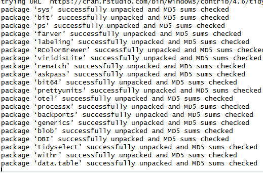

## Working With Data using R 

One of R's most powerful attributes is it's ability to work with data. From 
cleaning through analysis, R has a diversity of libraries and tools
to work with any data sets and to meet any goals. This guide will focus on 
how to move data into R and the basics on accessing data in a data set 

-------------------------------------------------------------------------------

## Reading Data into R 

### Commonly Installed Files 

|File Abbreviation| File Name| 
|-----------------------|-----------------|
|CSV|Comma-Separated Values|
|TSV| Tab-Separated Values|
|XLS|Excel Spreadsheet (old)|
|XLSX|Excel Spreadsheet (New)|
|gsheet|Google Sheet File|
|FWF|Fixed-Width File|
|JSON|Java Script Object Notation|

### Base R Data Reading

R provides commands to read in data files without the use of packages. However,
for more complex projects, base R can be limiting.

```r

read.csv("enter/your/file/path/here.csv")

```
R can also read in files from a URL 

```r

read.csv(url(enter your url link here.csv))

```

### Installing Packages

Installing packages can widen the scope of your data reading capabilities. There
are a broad array of packages that exist online that can meet certain goals 

|Package|Readable File Types|
|--------------------|-------|
|tidyVerse     |CSV's, TSV's, Text, XLSX, Google Sheets,Fixed Width Files| 
|readr         |CSV'S, TSV'S, Text, XLSX, Google Sheets, FWF|
|readxl        |XLX,XLSX| 

Installing the Tidyverse package will be suitable for most file reading needs.

--------------------------------------------------------------------------------

## File Reading Procedures 

### Setting up your file directory

Make sure that your current working directory is set to your home directory 

```r

> cd ~

#This will take you to the home directory in the console
```

**Download your data files to your computer**. Make sure that you know where
your storing them in your computer so you can pull them later with ease. 

### Installing your package of choice 

for using tidyverse as an example. We first need to install Tidyverse 

```r
install.packages("tidyverse")
```

We know tidyverse has been installed when we run it and are given a long series 
of code; this is our computer downloading all the packages and programs that
tidyverse offers.





Next, we will pull our package from our library 

```r
library(tidyverse)
```

This will allow us to use the commands offered by tidyverse

### Reading in a file

For Tidyverse, we can read in a multitude of files like so 

```r
read_csv(This/is/the/path/to/your/file/file_name.csv)
```

you will know the file has been successfully downloaded when it appears in your 
environment in the top right panel 

-------------------------------------------------------------------------------

## Navigating your Data set

This guide will provide you the baseline tools for accessing rows, columns, and
elements in your data set

### Accessing Columns 

We can access columns in a data set by using the $ command as well as our [] syntax

This code will allow us to return a column as a vector 

```r

desired_column <- dataframe$column

```

This code will allow us to return a column as a dataframe variable

```r

desired_column_dS <- dataframe["column"]

```

we can also mutate columns in RStudio through a simple command

```r

names(dataframe)[names(dataframe) == "column"] <- "new column name"

```
Selecting certain columns from a data set

```r

Selected_Columns <- dataframe[c("colname1","colname2")]

```

### Accessing Rows 

We can commonly access rows through filtering them.

Filtering rows

```r

Filtered <- Dataframe(Dataframe$column = "Certain Value")

```

### Accessing elements in rows 

Another important aspect of data management is accessing the elements within 
specific rows and columns

We can access specific elements in matrices, vectors, lists, and data frames 

**Vectors**

```r
# we will use an example vector

vector <- c(10,20,25,200,1000)

#pulling the value 10

pulled_value <- vector[1]

10

# we can do the same to access multiple values 

multilpe_values <- vector[c(1,5)]

10 , 1000

```

**Matrices**

```r

# we will create an example matric
 
example_matrix <- matrix(1:25, nrow = 5, ncol = 5) # this is a 5 by 5 matrix 

# This is how we want to pull a specific row from the matrix 

row_matrix <- example_matrix(2, ) 

``` 
This will print all the values of row 2


`[6,7,8,9,10]`

We can also pull specific row and column values

```
Specific_matrix <- example_matrix(2,4) # 2nd row, 4th column

[9]

```

We can access values in specific rows and columns in entirety 

```

Specific_Rows_and_Columns <- example_matrix[c(1,2),C(4,5)]

```
We can also modify values 

```
example_matrix[1,1] <- 100

```


**Lists**


Let's look at how we can modify the elements within a list 

```
example_list <- list(
age <- c(1,5,13,18)
name <- c("Julie","Richard","Will","Grant")
Status <- c("Baby","Toddler","Teenager"."Adult")
)
``` 
If we want to only know the age column we can do an operation such as this 


`example_list[[1]]`

If we want to know the age and their status we can expand on our operation 

`example_list[[1]][3]`

Finally, we can access specific elements within our list

`example_list$name[2] #This would return Richard `


**Datasets** 

```r
#Datasets are similar to lists.

data set_example <- df(
age <- c(1,5,13,18)
name <- c("Julie","Richard","Will","Grant")
Status <- c("Baby","Toddler","Teenager"."Adult")
))

dataset_element <- dataset_example(2,1) #This code will pull the name from column 1: Julie 

```


### Applications of Navigating Datasets

Being able to navigate through your dataframe,vector,list,or matrix quickly
will allow you to clean your data more efficiently and provide a strong foundation
for future work. 

--------------------------------------------------------------------------------

## Using Dplyr

We will briefly touch on Dplyr and it's use in R. Dplyr is a package that provides
a multitude of functions that will make tedious cleaning procedures in base R 
much quicker and far more effective

### Accessing Dplyr

Accessing Dplyr will require following the same procedure that was followed earlier 
for accessing Tidyverse

```r

install.packages("dplyr")
library(dplyr)

```

### Common Dplyr commands 

**Filter**

Filter allows you to select for only certain values in a column that match a desired 
value 

 R syntax allows you to use **%>%** (preferred) or **|>** to select a 
data frame you will be working from. This will go at the end of each line 

```r

Example_dataframe %>%
filter(column name == "certain value")

```

#This filter will provide only certain values from one column
#other comparative operators can be used with this command such as >, <, >=, and <= 


**Select**

Select is a streamlined command that allows you to select certain columns from your dataset

```r

Selected_DF <- Dataframe |>
select("This Column", "This other column", "Ooh maybe this one!")

```

**Mutate**

This is a similar command to the one we did earlier, where we were able to change the value of a column
The difference is that we are able to apply a function or changes to a column, which will create a new column with
those changes applied 

```r

Mutated_DF <- Dataframe %>%
mutate(
new_column <- existing_column * 2 %>%
# we can also mutate a singular column
existing_column <- existing_column * 2 
)
```

**Rename**

This command allows us to rename a column to something cleaner

```r

Dataframe |>
new_name <- old_name

```

--------------------------------------------------------------------------------

## Applying What we Have Learned 

We can apply what we have learned to compute introductory data cleaning. 

Prompt: For an introductory R class you have been assigned to create 2 new 
datasets from an existing dataset

**Dataset 1** 

We want our raw dataset to only contain the first 2 columns, and the first 2 rows 

**Dataset 2** 

We want to only include rows that have an age greater then 20 

### Practice Code

```r

raw_data <- df(
name_column <- c("Darnold","Matilda","Juan","Louise","Aaron","Elena")
age_column <- c(10,20,17,14,32,21)
school <- c("elementary","college","highschool","junior","postgrad","college")
grade <- c(4,N/A,11,8,N/A,N/A)
)

#First we will declare our first dataset
Dataset_1 <- raw_data(1:2, 1:2) |> #This line of code alone completes our first goal! 
Dataset_2 <- raw_data(raw_data$age_column > 20)
             
```
### Best Practices 


- **Use Clear Naming Conventions** when you are naming datatypes

- **Never Change the raw Data**, it's best to create a clean data copy of your raw
data that you have manipulated 

- **Document your work** so that you can come back to it later and understand 
what you have changed


### Summary 

This guide goes over the basics of accessing data files and beginning to learn 
to navigate them. We recommend accessing the resources in the resource hub to 
learn more about using R to prepare you for future classwork and jobs that will 
require it! 
